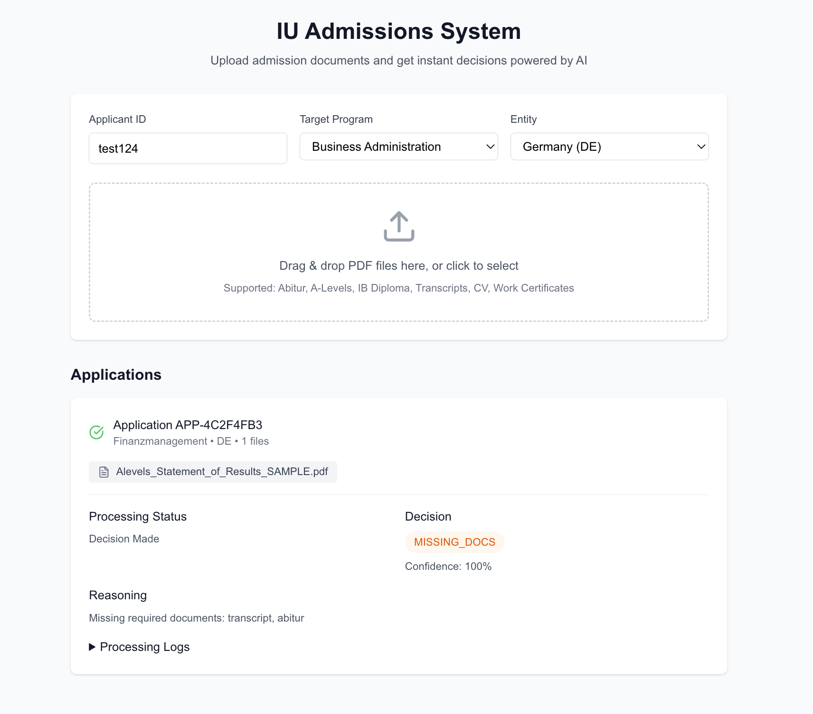

# Admissions Automation System

A complete admission processing system that uses AI agents and RAG to automate admission workflow for up to 50k+ students annually.

## System Architecture

```
├── frontend/                # Next.js web interface
│   ├── app/                 # App router pages
│   │   ├── page.tsx         # Main application page with upload UI
│   │   ├── layout.tsx       # Root layout
│   │   └── globals.css      # Global styles
│   ├── public/              # Static assets
│   ├── package.json         # Frontend dependencies
│   ├── tsconfig.json        # TypeScript configuration
│   ├── tailwind.config.ts   # Tailwind CSS configuration
│   └── next.config.ts       # Next.js configuration
├── backend/
│   ├── main.py              # FastAPI application
│   ├── agents/              # AI Agent pipeline
│   │   ├── document_classifier.py  # Document type classification
│   │   ├── data_extractor.py       # Data extraction from documents
│   │   ├── admission_agent.py      # RAG-based admission decisions
│   │   ├── workflow.py             # Agent orchestration
│   │   └── state.py               # Application state management
│   ├── rag/                 # RAG system for handbook queries
│   │   ├── handbook_loader.py      # PDF processing (one-time)
│   │   ├── vector_store.py         # ChromaDB integration
│   │   └── retriever.py            # Query engine for admission rules
│   └── chroma_db/           # Pre-built vector database (245 pages indexed)
├── data/                    # Sample documents (excluded from git)
│   ├── ABITUR/              # German Abitur samples
│   ├── ALEVELS/             # UK A-Levels samples
│   ├── IB_DIPLOMA/          # IB Diploma samples
│   └── samples/             # Complex multi-document cases
└── requirements.txt
```

## User Interface



## Quick Start

### Backend Setup

1. **Install Python dependencies:**
```bash
pip install -r requirements.txt
```

2. **Start the backend server** (ChromaDB already initialized):
```bash
cd backend
python main.py
```

### Frontend Setup

3. **Install Node dependencies:**
```bash
cd frontend
npm install
```

4. **Start the frontend:**
```bash
npm run dev
```

5. **Open the application:**
Navigate to `http://localhost:3000` in your browser

### API Testing (Optional)

**Submit an application via API:**
```bash
curl -X POST http://localhost:8000/submit-application \
  -F "applicant_id=test123" \
  -F "target_program=Finanzmanagement" \
  -F "entity=DE" \
  -F "files=@../data/ABITUR/Abitur_Zeugnis_SAMPLE.pdf"
```

**Check the decision:**
```bash
# Use the returned application ID
curl http://localhost:8000/application/APP-XXXXXXXX
```

## How The System Works

### 1. One-Time Setup (Already Done ✅)
- The 245-page `Leitfaden.pdf` handbook was processed once
- Split into ~1500 character chunks with overlap
- Embedded using free local Sentence Transformers
- Stored in ChromaDB vector database
- **No re-processing needed - the database is ready to use**

### 2. Three-Agent Pipeline

When an application is submitted, it flows through three AI agents:

**🤖 Agent 1: Document Classifier**
- Uses Claude 3.5 Sonnet to identify document types
- Recognizes: Abitur, A-Levels, IB, transcripts, CV, work certificates, etc.
- Returns classification with confidence score

**📊 Agent 2: Data Extractor**
- Extracts structured data from classified documents
- Pulls out: grades, personal info, qualifications, dates
- Adapts extraction templates based on document type

**⚖️ Agent 3: Admission Decision (RAG-Powered)**
- Queries ChromaDB for relevant handbook sections
- Uses Claude to interpret admission rules contextually
- Makes decision: APPROVED/REJECTED/REVIEW_REQUIRED/MISSING_DOCS
- Provides reasoning with handbook page citations

### 3. RAG System Details

- **Fast Query**: Pre-built embeddings enable instant rule lookup
- **Contextual**: Claude interprets rules based on specific applicant profile
- **Transparent**: Every decision includes handbook page references
- **Accurate**: Combines semantic search with LLM reasoning

## API Endpoints

### Application Processing
- `POST /submit-application` - Submit documents for processing
- `GET /application/{id}` - Get detailed application status and decision
- `GET /applications` - List all processed applications

### Handbook Queries
- `POST /query-handbook` - Query admission rules directly
- `GET /handbook-status` - Check if RAG system is ready

### System
- `GET /health` - Health check
- `GET /` - System information

## Key Features

- ✅ **Web Interface** - User-friendly drag & drop PDF upload interface
- ✅ **Complete automation** - Processes documents end-to-end
- ✅ **Multi-document support** - Handles complex applications
- ✅ **RAG-based decisions** - Uses 245-page handbook intelligently
- ✅ **Free embeddings** - No OpenAI costs for vector storage
- ✅ **Transparent reasoning** - Every decision explained with citations
- ✅ **Scalable architecture** - Handles high volume (50k+ applications)
- ✅ **Multiple qualifications** - Supports Abitur, A-Levels, IB, work experience
- ✅ **Regulatory compliance** - Checks complex admission rules automatically
- ✅ **Real-time processing** - Live status updates and polling

## Sample Results

```json
{
  "application_id": "APP-12345678",
  "current_stage": "decision_made", 
  "decision": {
    "status": "APPROVED",
    "confidence": 0.95,
    "reasoning": "German Abitur with grade 1.58 provides direct access to Finanzmanagement program",
    "applied_rules": [
      {
        "rule_id": "R1",
        "rule_text": "Allgemeine Hochschulreife grants direct university access",
        "outcome": "satisfied"
      }
    ],
    "handbook_citations": ["page 42", "section 3.2.1"]
  }
}
```

## Solution Architecture & Design

### High-Level Architecture

```
┌─────────────────┐     ┌──────────────────┐     ┌─────────────────┐
│   Web Portal    │────▶│   FastAPI        │────▶│   AI Pipeline   │
│   (Next.js)     │     │   Backend        │     │   (3 Agents)    │
└─────────────────┘     └──────────────────┘     └─────────────────┘
                               │                          │
                               ▼                          ▼
                        ┌──────────────────┐     ┌─────────────────┐
                        │   ChromaDB       │     │   Handbook      │
                        │   (Vector Store) │◀────│   (245 pages)   │
                        └──────────────────┘     └─────────────────┘
                               │
                               ▼
                        ┌──────────────────┐
                        │  CRM Integration │
                        │  (Salesforce/SMS)│
                        └──────────────────┘
```

### Three-Agent Processing Pipeline

**Agent 1: Document Classifier**
- Uses Claude 3.5 Sonnet to identify document types
- Recognizes: Abitur, A-Levels, IB, transcripts, work certificates
- Returns classification with confidence score

**Agent 2: Data Extractor**
- Extracts structured data from classified documents
- Pulls out: grades, personal info, qualifications, dates
- Adapts extraction templates based on document type

**Agent 3: Admission Decision Agent (RAG-Powered)**
- Queries ChromaDB for relevant handbook sections
- Uses Claude to interpret admission rules contextually
- Makes decision: APPROVED/REJECTED/REVIEW_REQUIRED/MISSING_DOCS
- Provides reasoning with handbook page citations

### Key Design Decisions & Trade-offs

**1. RAG vs Hard-coded Rules**
- ✅ **Chosen:** RAG with LLM interpretation
- **Pros:** Handles edge cases, natural language rules, easy updates
- **Cons:** ~€0.10 per application API cost, non-deterministic
- **Mitigation:** Temperature=0, confidence thresholds

**2. Local vs Cloud Embeddings**
- ✅ **Chosen:** Local Sentence Transformers
- **Pros:** Zero embedding costs, data privacy, consistent performance
- **Cons:** Slightly lower quality than OpenAI
- **Savings:** ~€2,000/year in embedding costs

**3. Processing Model**
- ✅ **Chosen:** Asynchronous with real-time polling
- **Pros:** Better UX, handles peak loads, scalable
- **Cons:** More complex frontend, requires status tracking

### Performance & Scale

**Current Benchmarks:**
- Document Classification: ~2 seconds
- Data Extraction: ~3 seconds
- Decision Making: ~2 seconds
- **Total:** ~7-10 seconds per application

**Production Targets:**
- **Throughput:** 500+ applications/hour per instance
- **Scalability:** Horizontal scaling for 10k+ daily peaks
- **Accuracy:** 95%+ for standard cases, 100% review for edge cases
- **Automation Rate:** 85%+ fully automated decisions

### Risk Mitigation

**AI Decision Accuracy**
- Confidence thresholds trigger human review
- Every decision includes handbook citations for verification
- Complete audit logs for regulatory compliance

**System Availability**
- Local vector database (no external dependencies for rules)
- Fallback to manual processing queue
- Health checks and auto-restart mechanisms

**Data Privacy & Compliance**
- On-premise deployment option
- Local embeddings (no data to external APIs)
- Encrypted storage with GDPR-compliant retention
- Transparent decision-making with citations

### Cost-Benefit Analysis

**Annual Costs:**
- AI API (Claude): ~€5,000 (50k applications × €0.10)
- Infrastructure: ~€2,400 (cloud hosting)
- Development: One-time €50,000
- Maintenance: ~€10,000/year

**Annual Benefits:**
- Time Savings: 40,000 hours (50k applications × 50 minutes saved)
- Cost Savings: ~€1,000,000 (40,000 hours × €25/hour)
- Improved accuracy and faster enrollment

